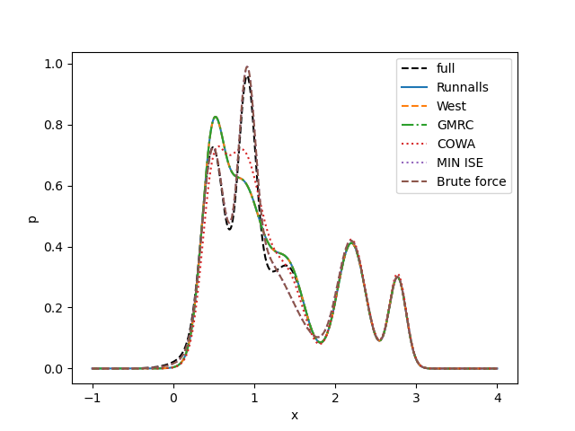

# Gaussian Mixture Reduction

Algorithms in ["A Look At Gaussian Mixture Reduction Algorithms"](https://ieeexplore.ieee.org/stamp/stamp.jsp?arnumber=5977695) for reducing gaussian mixtures are implemented.

1) Runnalls algorithm
2) West algorithm
3) GMRC (without refinement)
4) COWA (constrained optimized weight optimization)

Also, I tried to reproduce results in the paper and got similar one. (see [eval.py](./eval.py))

|          | ISE Mean | ISE Std |
|----------|----------|---------|
| Runnalls | 0.08211  | 0.08062 |
| West     | 0.10452  | 0.09380 |
| GMRC     | 0.08208  | 0.08062 |
| COWA     | 0.10172  | 0.09124 |

But, I could not reproduce Fig.1 in the paper. (see [demo.py](./demo.py))

Future works list are
- [ ] Component means and variance refinement via gradient descent
- [ ] Brute-force initialization to show optimality gap
